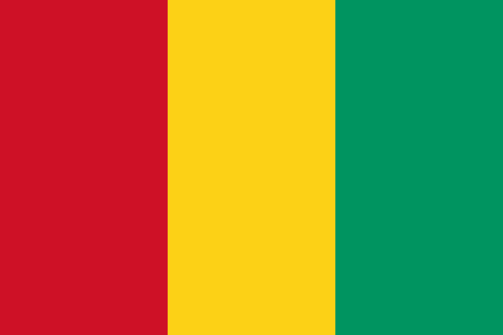

# whatsapp_art
A python program to generate Emoji art. The art is generated in a fixed width of 10 emojis, in order to be compatible with Whatsapp Messages.

**Functionalities:**
1. Transform an Image into Emoji art.
2. Transform simple text into Emoji art (customizable colors).
3. Draw Among-us character in Emoji art (customizable colors).

## Examples:
### (1 - Image to Emoji art)
code:
``` python
drawing = Drawing()
drawing.translate_image("image/src/here.cool", True)
# the second parameter is to decide about the usage of the NEAREST filter.
# (See examples below about it in chapter "the NEAREST filter")  
```
| Input Image  | Result | Source|
| ------------- | ------------- | ------------- |
|  |❤️💙💙💙💙💙💙💙💙💙<br>❤️❤️❤️🤍🤍🤍🤍🤍🤍🤍<br>❤️🤍❤️❤️💙💙💙💙💙💙<br>❤️❤️❤️🤍🤍🤍🤍🤍🤍🤍<br>❤️💙💙💙💙💙💙💙💙💙 | Flag of Cuba |
|  |❤️❤️❤️💛💛💛💛💚💚💚<br>❤️❤️❤️💛💛💛💛💚💚💚<br>❤️❤️❤️💛💛💛💛💚💚💚<br>❤️❤️❤️💛💛💛💛💚💚💚<br>❤️❤️❤️💛💛💛💛💚💚💚<br>❤️❤️❤️💛💛💛💛💚💚💚<br>❤️❤️❤️💛💛💛💛💚💚💚| Flag of Guinea |
|  |💚💚💚💚💚💚💚💛🖤🖤<br>💚💚💚💚💚💛🖤🖤🖤💛<br>💚💚💚💚💛🖤🖤🖤💛💙<br>💚💚💚🖤🖤🖤🖤💙💙💙<br>💚💛🖤🖤🖤💛💙💙💙💙<br>💛🖤🖤🖤💛💙💙💙💙💙<br>🖤🖤💛💙💙💙💙💙💙💙| Flag of Tanzania |
| |💜💜💜💜💜💜💜💜💜💜<br>💜💜💜💜💜💜💜💜💜💜<br>💜💜💜🤍💜💜🤍💜💜💜<br>💜💜🤍🤍🤍🤍🤍🤍💜💜<br>💜💜🤍🤍🤍🤍🤍🤍🤍💜<br>💜🤍🤍💜🤍💜💜🤍🤍💜<br>💜🤍🤍🤍🤍🤍🤍🤍🤍💜<br>💜💜🤍💜💜💜💜🤍💜💜<br>💜💜💜💜💜💜💜💜💜💜<br>💜💜💜💜💜💜💜💜💜💜|Discord's logo|

### (2 - Text to Emoji art)
code:
``` python
drawing = Drawing()
drawing.add_text("TEXT HERE", "main_color", "background_color")
```


`drawing.add_text("Hi", "blue", "pink")`

💗💗💗💗💗💗💗💗💗💗\
💗💗💙💗💗💗💗💙💗💗\
💗💗💙💗💗💗💗💙💗💗\
💗💗💙💗💗💗💗💙💗💗\
💗💗💙💙💙💙💙💙💗💗\
💗💗💙💗💗💗💗💙💗💗\
💗💗💙💗💗💗💗💙💗💗\
💗💗💙💗💗💗💗💙💗💗\
💗💗💙💗💗💗💗💙💗💗\
💗💗💗💗💗💗💗💗💗💗\
💗💗💗💗💙💗💗💗💗💗\
💗💗💗💗💗💗💗💗💗💗\
💗💗💗💗💙💗💗💗💗💗\
💗💗💗💗💙💗💗💗💗💗\
💗💗💗💗💙💗💗💗💗💗\
💗💗💗💗💙💗💗💗💗💗\
💗💗💗💗💙💗💗💗💗💗\
💗💗💗💗💗💗💗💗💗💗


### (3 - Among-us character)
code:
``` python
drawing = Drawing()
drawing.draw_amogus("body_color", "background_color")
```

`drawing.draw_amogus("pink", "green")`

💚💚💚💚💚💚💚💚💚💚\
💚💚💚💚💗💗💗💗💚💚\
💚💚💚💗💗💗💗💗💗💚\
💚💚💚💗💗💙💙💙💙💚\
💚💗💗💗💗💙💙💙💙💚\
💚💗💗💗💗💙💙💙💙💚\
💚💗💗💗💗💗💗💗💗💚\
💚💗💗💗💗💗💗💗💗💚\
💚💗💗💗💗💗💗💗💗💚\
💚💚💚💗💗💗💗💗💗💚\
💚💚💚💗💗💚💗💗💚💚\
💚💚💚💗💗💚💗💗💚💚\
💚💚💚💚💚💚💚💚💚💚


### the NEAREST filter:
| without the NEAREST filter  | with the NEAREST filer | Logo|
| ------------- | ------------- | ------------- |
|🤍🤍🤍🤍🤍💗🤍🤍🤍🤍<br>🤍🤍💗❤️❤️❤️❤️💗🤍🤍<br>🤍💗❤️❤️❤️💗❤️💗🤍🤍<br>🤍❤️❤️🤍🤍🤍🤍🤍🤍🤍<br>💛🧡💗🤍🤍🤍🤍🤍🤍🤍<br>💛🧡🤍🤍🤍💙💙💙💙💜<br>💛🧡🤍🤍🤍🤍🤍💜💙💜<br>🤍💚💚🤍🤍🤍🤍💙💙🤍<br>🤍💜💚💚💙💜💚💙💜🤍<br>🤍🤍💜💚💚💚💚💙🤍🤍<br>🤍🤍🤍🤍🤍🤍🤍🤍🤍🤍  | 🤍🤍🤍🤍🤍🤍🤍🤍🤍🤍<br>🤍🤍💗❤️❤️❤️❤️❤️🤍🤍<br>🤍❤️❤️❤️❤️❤️❤️❤️🤍🤍<br>🤍❤️❤️🤍🤍🤍🤍🤍🤍🤍<br>🤍🧡❤️🤍🤍🤍🤍🤍🤍🤍<br>🧡🧡🤍🤍🤍💙💙💙💙💙<br>🤍🧡💜🤍🤍🤍🤍🤍💙🤍<br>🤍💚💚🤍🤍🤍🤍💙💙🤍<br>🤍💚💚💚💚💚💚💙💙🤍<br>🤍🤍💚💚💚💚💚💚🤍🤍<br>🤍🤍🤍🤍🤍🤍🤍🤍🤍🤍|[Google's favicon](./examples/google_logo.png)|
|🤍🤍💜🤎🖤🖤🤎💜🤍🤍<br>🤍🤎🖤🖤🖤🖤🖤🖤🤎🤍<br>💜🖤💜💜💜💜💜💜🖤💜<br>🖤🖤🤍🤍🤍🤍🤍🤍🖤🤎<br>🖤🖤🤍🤍🤍🤍🤍🤍🖤🖤<br>🖤🖤🤍🤍🤍🤍🤍🤍🖤🖤<br>🖤🖤💜🤍🤍🤍🤍💜🖤🤎<br>💜🤎🤎🤎🤍🤍🤎🖤🖤💜<br>🤍🤎🤎💜🤍🤍🤎🖤🤎🤍<br>🤍🤍💜💜🤍🤍💜💜🤍🤍|🤍🤍🤍🖤🖤🖤🖤🤍🤍🤍<br>🤍🖤🖤🖤🖤🖤🖤🖤🖤🤍<br>🤍🖤🤍🤍🤍🤍🤍🤍🖤🤍<br>🖤🖤🤍🤍🤍🤍🤍🤍🖤🖤<br>🖤🖤🤍🤍🤍🤍🤍🤍🖤🖤<br>🖤🖤🤍🤍🤍🤍🤍🤍🖤🖤<br>🖤🖤🤍🤍🤍🤍🤍🤍🖤🖤<br>🤍🖤🖤🖤🤍🤍🖤🖤🖤🤍<br>🤍🖤🖤🤍🤍🤍🖤🖤🖤🤍<br>🤍🤍🤍🖤🤍🤍🖤🤍🤍🤍|[GitHub mark logo](./examples/github_logo.png)|
|🤍🤍💗❤️❤️❤️❤️💗🤍🤍<br>🤍💗❤️❤️❤️❤️❤️❤️💗🤍<br>🤍🤎❤️❤️❤️❤️❤️❤️❤️🤍<br>💙🤎🤎💗💜💜💗🧡💛💛<br>💚💚🤎💜💙💙💜💛💛💛<br>💚💚🤎💜💙💙💜💛💛💛<br>💙💚💚💙💜💙🤍💛💛💛<br>🤍💚💚💚💙💙💛💛💛🤍<br>🤍💙💚💚💚💚💛💛🤍🤍<br>🤍🤍🤍💙💚💛💛🤍🤍🤍 | 🤍🤍🤍❤️❤️❤️❤️🤍🤍🤍<br>🤍🤎❤️❤️❤️❤️❤️❤️❤️🤍<br>🤍🤎❤️❤️❤️❤️❤️❤️❤️🤍<br>💚🤎🤎🤍💙💙🤍💛💛💛<br>💚💚🤎💙💙💙💙💛💛💛<br>💚💚💚💙💙💙💙💛💛💛<br>💚💚💚🤍💙💙🤍💛💛💛<br>🤍💚💚💚💚💚💛💛💛🤍<br>🤍💚💚💚💚💚💛💛💛🤍<br>🤍🤍🤍💚💚💛💛🤍🤍🤍|[Google Chrome icon](./examples/chrome_logo.png)|

